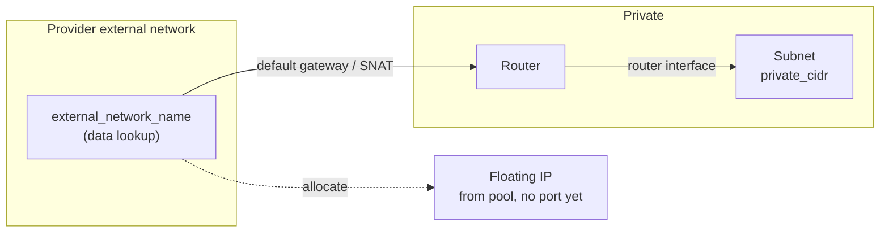
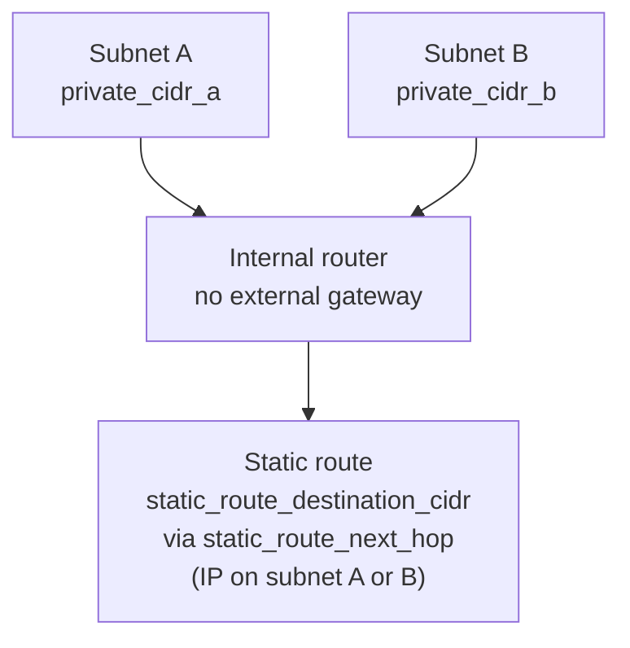

# 10-network

Neutron lesson in **one directory**: (1) **north–south** — private network, subnet, router with **external gateway**, floating IP; (2) **east–west / internal** — second topology with an **internal router** (no external gateway), two subnets, and an **extra static route**.

## Part A — External gateway and floating IP

*Rendered with [Mermaid](https://mermaid.js.org/). Visible on GitHub/GitLab; in other editors enable Mermaid preview if you see the source.*

| Piece | Terraform | Role |
|--------|-----------|------|
| External network | `data.openstack_networking_network_v2.external` | Lookup by `external_network_name` |
| Private network | `openstack_networking_network_v2.private` | L2 network |
| Subnet | `openstack_networking_subnet_v2.private` | IPv4 CIDR |
| Router | `openstack_networking_router_v2.private` | Default gateway to the external network |
| Router interface | `openstack_networking_router_interface_v2.private` | Subnet ↔ router |
| Floating IP | `openstack_networking_floatingip_v2.floating` | Allocation from external pool (not bound to a VM yet) |

## Part B — Internal router and static route

*Same Mermaid note as Part A.*

| Piece | Terraform | Role |
|--------|-----------|------|
| Networks A / B | `openstack_networking_network_v2.a` / `.b` | Two isolated private networks |
| Subnets | `openstack_networking_subnet_v2.a` / `.b` | `private_cidr_a`, `private_cidr_b` |
| Internal router | `openstack_networking_router_v2.internal` | **No** `external_network_id` |
| Interfaces | `openstack_networking_router_interface_v2.a` / `.b` | Router ↔ both subnets |
| Static route | `openstack_networking_router_route_v2.static` | Remote prefix via `static_route_next_hop` |

See `main.tf` and `internal_router.tf`.

## Prerequisites

Finish `examples/00-provider-auth`. Reuse:

- `auth_url`, `region`, `application_credential_id`, `application_credential_secret`

## Inputs

**Required**

- `external_network_name` — provider external/public network name (Part A and floating IP pool).
- `static_route_next_hop` — IPv4 **inside** `private_cidr_a` or `private_cidr_b` (Neutron requirement).

**Optional**

- `name_prefix` (default `tf-lesson-network`)
- `private_cidr` — Part A subnet (default `192.168.42.0/24`)
- `private_cidr_a`, `private_cidr_b` — Part B (defaults `192.168.10.0/24`, `192.168.20.0/24`)
- `static_route_destination_cidr` (default `172.16.0.0/16`)
- `dns_nameservers`

## Layout

- `main.tf` — Part A
- `internal_router.tf` — Part B
- `providers.tf`, `versions.tf`, `variables.tf`, `outputs.tf`, `terraform.tfvars.example`

## Steps

1. Copy `terraform.tfvars.example` to `terraform.tfvars` and set auth, `external_network_name`, and `static_route_next_hop`.
2. `terraform init` / `plan` / `apply`.

## Outputs

**Part A:** `network_id`, `subnet_id`, `router_id`, `external_network_id`, `floating_ip_id`, `floating_ip_address`

**Part B:** `network_a_id`, `subnet_a_id`, `network_b_id`, `subnet_b_id`, `internal_router_id`, `static_route_id`

Use these in later lessons (for example `examples/20-compute`).

## Troubleshooting

If `terraform plan` fails with **no suitable endpoint in the service catalog** for networking, see the [OpenStack provider docs](https://registry.terraform.io/providers/terraform-provider-openstack/openstack/latest/docs). Clear stray `OS_*` env vars and confirm `region`.
